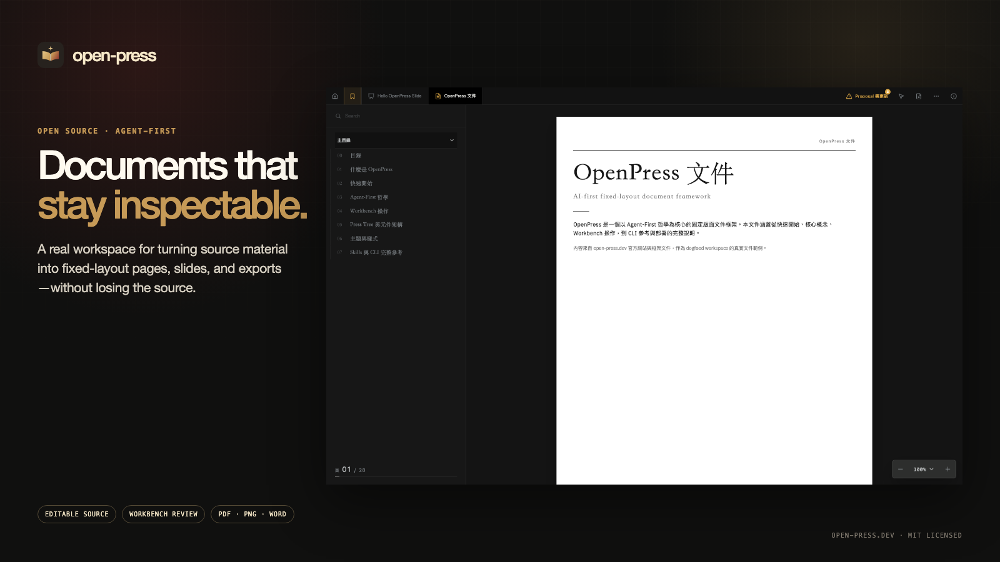

# open-press

> AI-first fixed-layout document framework for reports, proposals, guides, papers, and books. Creative skills decide what to make; OpenPress handles review, source editing, rendering, PDF/Word export, and web delivery.

[](https://www.npmjs.com/package/@open-press/cli)
[](https://www.npmjs.com/package/@open-press/cli)
[](https://www.npmjs.com/package/@open-press/core)
[](https://open-press.dev)
[](LICENSE)



OpenPress is for documents where **content keeps changing but the output format must stay stable**: proposals, whitepapers, reports, course notes, handbooks, and books.

## Start

Prerequisite: Node.js 20 or newer. Use Node.js 24 for framework development and Cloudflare Pages builds.

```bash
mkdir my-report && cd my-report
npx --yes skills@1.5.18 add quan0715/open-press \
  --skill openpress openpress-apply-comments openpress-collaborate \
  openpress-create-pages openpress-plugins openpress-deploy openpress-upgrade \
  --agent universal claude-code --yes
codex # or claude
```

Then ask the agent:

```txt
Use OpenPress to turn these notes into a five-page research brief. Start the workbench so I can review the pages before export.
```

The agent sets up the workspace, keeps the document in editable source, and opens the local Workbench for review before export.

## Create With AI

Open the workspace in a skill-aware agent such as Claude Code or Codex CLI:

```bash
claude
# or
codex
```

Ask naturally:

```txt
Turn this source folder into a project proposal I can review and deliver as PDF and Word.
```

Creation is split by artifact type:

- `openpress-create-pages` creates reports, proposals, papers, books, teaching notes, and handbooks.
- `openpress-collaborate` coordinates analysis, exact change previews, comments, and reviewed source edits.
- `openpress` owns CLI lifecycle, validation, rendering, export, and routing.
- `openpress-plugins` recommends and adapts external specialist skills when they fit the work.
- `openpress-upgrade` owns package upgrades and workspace migration QA.

For Copilot Chat or other tools that do not auto-discover `SKILL.md`, see [manual agent setup](docs/skills.md#manual-agent-setup).

### Skills

`npm create @open-press` installs skills automatically. To install or update them separately:

```bash
# Install
npx --yes skills@1.5.18 add quan0715/open-press --skill openpress openpress-apply-comments openpress-collaborate openpress-create-pages openpress-plugins openpress-deploy openpress-upgrade --agent universal claude-code --yes

# Update to latest
npm run openpress:skills
# or, in core-only workspaces:
node node_modules/@open-press/core/engine/cli.mjs skills:sync .

# External specialist skills are recommended by openpress-plugins only when needed.
```

Skills land canonically in `.agents/skills/`; the installer maintains
`.claude/skills/` links for Claude Code. OpenPress pins the installer version
that supports its Node.js 20 runtime contract, while skill content still
refreshes from the latest source revision recorded in `skills-lock.json`.

### Bootstrap Prompts

Use these when the agent does not yet have the OpenPress skills installed.

**Create a new workspace (empty folder, no skills):**

```txt
Run `npx --yes skills@1.5.18 add quan0715/open-press --skill openpress openpress-apply-comments openpress-collaborate openpress-create-pages openpress-plugins openpress-deploy openpress-upgrade --agent universal claude-code --yes`
to install the OpenPress skills.
Once installed, use the openpress-create-pages skill to set up a new workspace
or add a document Press to this folder.
```

**Upgrade an existing workspace:**

```txt
Use the openpress-upgrade skill.
It updates framework packages and skills, reads applicable migration docs,
scans press/ source, applies confirmed migrations, and loops through Migration QA.
```

## Why OpenPress? (AI Publishing Comparison)

Comparing the 4 primary ways AI generates documents across speed, layout aesthetics, token consumption, and human editability:

| Method | Speed | Layout & Aesthetics | Token Cost | Human Editability | Best For |
| :--- | :--- | :--- | :--- | :--- | :--- |
| **Markdown** | 🟢 Ultra Fast | 🟡 Basic (No pagination, broken layout on PDF export) | 🟢 Minimal (Plain text) | 🟢 Very Easy (Direct text edits) | Internal notes, rough drafts |
| **Word (DOCX)** | 🔴 Slow | ⚪ Average (Rigid templates, clumsy micro-typesetting) | 🔴 High (Script & XML generation overhead) | 🟢 Easy (Direct edits in Office) | Legacy corporate memos |
| **HTML** | ⚪ Medium | ⚪ High on screen (Awkward page splits on PDF print) | 🔴 Huge (Endless tag & class bloat) | 🔴 Very Hard (Heavy tag noise) | Websites, single-page UI |
| **OpenPress ⭐** | 🟢 **Fast** | 🔴 **Print-Grade 300DPI** (Fixed-page A4/slides, zero overflow) | 🟢 **Minimal** (3x–5x less tokens than HTML) | 🟢 **Very Easy** (Clean MDX + live preview) | **Whitepapers, reports, proposals, books** |

## What You Get

- Fixed-layout documents: A4 or a custom page geometry owned by each Press.
- Press Tree rendering from folder entries such as `press/report/press.tsx`.
- Multi-Press workspaces for a main document, appendix, handbook, or related editions.
- MDX/TSX authoring with document-owned components, themes, media, and pagination.
- Local workbench with exact AI change previews, source-linked comments, inline editing, mentions, and image export.
- PDF/Word export and Cloudflare Pages deploy workflow.
- Portable skills under `.agents/skills/` and `.claude/skills/`.

## Framework Development

This repo includes a tracked dogfood workspace in `press/`.

```bash
pnpm run dev:workspace  # dogfood press / workbench
pnpm run dev:web        # open-press.dev landing site
pnpm run build          # render every Press
pnpm run openpress:pdf  # export PDF
pnpm run openpress:word # export Word DOCX
pnpm run skills:link    # sync framework skills/ (SSOT) to .agents/skills/ and .claude/skills/
```

## More

| Want to | See |
| --- | --- |
| CLI commands | [docs/cli.md](docs/cli.md) |
| Press Tree model | [docs/press-tree.md](docs/press-tree.md) |
| Workbench UI | [docs/workbench.md](docs/workbench.md) |
| Skills and routing | [docs/skills.md](docs/skills.md) |
| Release / deploy | [docs/release-and-deploy.md](docs/release-and-deploy.md) |
| Contribute | [CONTRIBUTING.md](CONTRIBUTING.md) and [AGENTS.md](AGENTS.md) |
| Changelog | [CHANGELOG.md](CHANGELOG.md) |

## License

MIT - see [LICENSE](LICENSE).
