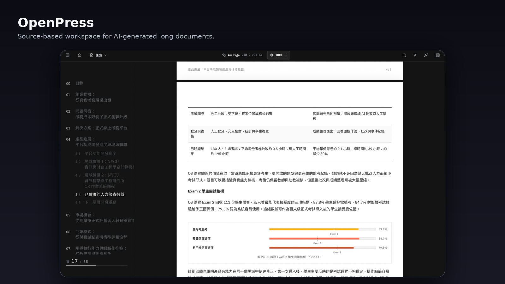

# open-press

> AI-first fixed-layout document framework. Creative skills decide what to make; OpenPress handles the workbench, inline editing, comment markers, rendering, PDF/image/Word export, and deploy plumbing.

[](https://www.npmjs.com/package/@open-press/cli)
[](https://www.npmjs.com/package/@open-press/cli)
[](https://www.npmjs.com/package/@open-press/core)
[](https://open-press.dev)
[](LICENSE)



OpenPress is for artifacts where **content keeps changing but the output format must stay stable**: proposals, whitepapers, reports, course notes, books, social cards, and slide decks.

## Start

Prerequisite: Node.js 20 or newer. Use Node.js 24 for framework development and Cloudflare Pages builds.

```bash
npm create @open-press my-deck -- --type slides
cd my-deck
npm run dev
```

The create package installs the framework packages and OpenPress skills. Open the local Vite URL, usually `http://127.0.0.1:5173/workspace`.

## Create With AI

Open the workspace in a skill-aware agent such as Claude Code or Codex CLI:

```bash
claude
# or
codex
```

Then ask naturally:

```txt
我想寫一份投資人提案，幫我起手。
```

Creation is split by artifact type:

- `openpress-create-pages` creates page-based documents.
- `openpress-create-slide` creates slide decks.
- `openpress-collaborate` coordinates analysis, exact change previews, comments, and reviewed source edits.
- `openpress` owns CLI lifecycle, validation, rendering, export, and routing.
- `openpress-upgrade` owns package upgrades and workspace migration QA.

For Copilot Chat or other tools that do not auto-discover `SKILL.md`, see [manual agent setup](docs/skills.md#manual-agent-setup).

### Skills

`npm create @open-press` installs skills automatically. To install or update them separately:

```bash
# Install
npx --yes skills@1.5.18 add quan0715/open-press --skill '*' --agent universal claude-code --yes

# Update to latest
npm run openpress:skills
# or, in core-only workspaces:
node node_modules/@open-press/core/engine/cli.mjs skills:sync .
```

Skills land canonically in `.agents/skills/`; the installer maintains
`.claude/skills/` links for Claude Code. OpenPress pins the installer version
that supports its Node.js 20 runtime contract, while skill content still
refreshes from the latest source revision recorded in `skills-lock.json`.

### Bootstrap Prompts

Use these when the agent does not yet have the OpenPress skills installed.

**Create a new workspace (empty folder, no skills):**

```txt
Run `npx --yes skills@1.5.18 add quan0715/open-press --skill '*' --agent universal claude-code --yes`
to install the OpenPress skills.
Once installed, use the openpress-create-pages or openpress-create-slide skill
to set up a new workspace or add a Press to this folder.
```

**Upgrade an existing workspace:**

```txt
Use the openpress-upgrade skill.
It updates framework packages and skills, reads applicable migration docs,
scans press/ source, applies confirmed migrations, and loops through Migration QA.
```

## What You Get

- Fixed-layout pages: A4, social formats, slide 16:9, or custom presets.
- Press Tree rendering from folder entries such as `press/slide/press.tsx`.
- Multi-Press workspaces: documents, cards, and slides in one project.
- Tailwind-first authoring with OpenPress semantic slide classes and protocol layouts.
- Local workbench with exact AI change previews, source-linked comments, inline editing, mentions, and image export.
- PDF/Word export and Cloudflare Pages deploy workflow.
- Portable skills under `.agents/skills/` and `.claude/skills/`.

## Framework Development

This repo includes a tracked dogfood workspace in `press/`.

```bash
pnpm run dev:workspace  # dogfood press / workbench
pnpm run dev:web        # open-press.dev landing site
pnpm run build          # render every Press
pnpm run openpress:pdf  # export PDF
pnpm run openpress:word # export Word DOCX
```

## More

| Want to | See |
| --- | --- |
| CLI commands | [docs/cli.md](docs/cli.md) |
| Press Tree model | [docs/press-tree.md](docs/press-tree.md) |
| Workbench UI | [docs/workbench.md](docs/workbench.md) |
| Skills and routing | [docs/skills.md](docs/skills.md) |
| Release / deploy | [docs/release-and-deploy.md](docs/release-and-deploy.md) |
| Contribute | [CONTRIBUTING.md](CONTRIBUTING.md) and [AGENTS.md](AGENTS.md) |
| Changelog | [CHANGELOG.md](CHANGELOG.md) |

## License

MIT - see [LICENSE](LICENSE).
